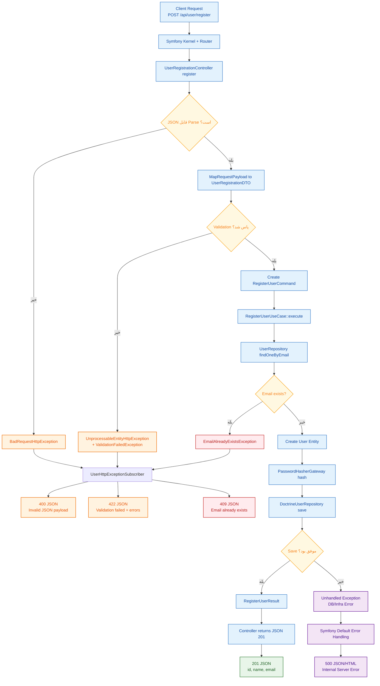

## نسخه دقیق‌تر نمودار (با همه شرایط)

### نکات دقت نمودار

- **400** فقط وقتی body از نظر JSON خراب باشد.
- **422** وقتی JSON درست است ولی validation فیلدها رد شود.
- **409** وقتی ایمیل قبلا موجود باشد (قانون دامنه).
- **201** وقتی تمام مراحل موفق باشد.
- **500** برای خطاهای پیش‌بینی‌نشده زیرساخت/سیستمی.

