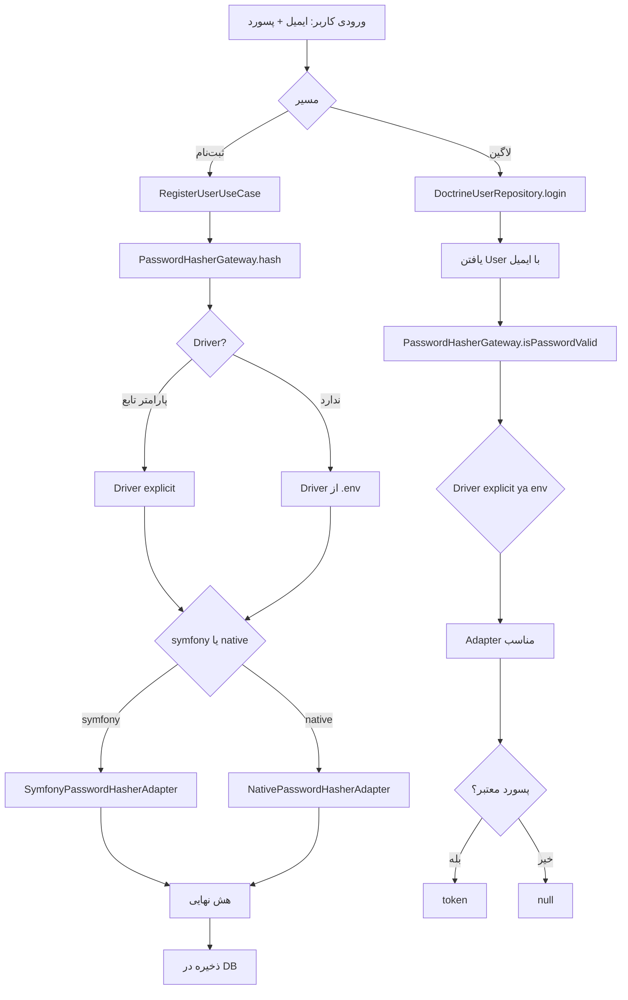

<div dir="rtl">

# مستند کامل ساختار Hash پسورد

این فایل همه تغییرات انجام‌شده را یکجا نشان می‌دهد:

- چه فایل‌هایی اضافه/ویرایش شدند
- جریان اجرای پسورد از ثبت‌نام تا لاگین
- نسخه توضیح **فنی**
- نسخه توضیح **خیلی ساده (سطح کلاس چهارم)**

---

## 1) لیست تغییرات انجام‌شده

### فایل‌های جدید

- `src/User/Infrastructure/Security/NativePasswordHasherAdapter.php`
- `src/User/Infrastructure/Security/SwitchablePasswordHasherGateway.php`
- `PASSWORD-HASHING-GUIDE.fa.md`
- `PASSWORD-HASHING-COMPLETE.fa.md` (همین فایل)

### فایل‌های ویرایش‌شده

- `src/User/Infrastructure/Security/SymfonyPasswordHasherAdapter.php`
- `src/User/Application/Port/PasswordHasherGateway.php`
- `src/User/Infrastructure/Persistence/Doctrine/DoctrineUserRepository.php`
- `config/services.yaml`
- `.env`

---

## 2) Flowchart جریان پسورد



---

## 3) توضیح فنی (نسخه حرفه‌ای)

### هدف معماری

یک abstraction به نام `PasswordHasherGateway` تعریف شده تا UseCase/Repository به الگوریتم واقعی hash وابسته نباشند.

### نحوه سوئیچ

`SwitchablePasswordHasherGateway` در زمان اجرا تصمیم می‌گیرد:

- اگر `driver` داخل تابع پاس داده شده باشد، همان استفاده می‌شود (Per-Call Override)
- اگر پاس داده نشده باشد، `PASSWORD_HASHER_DRIVER` از `.env` مبنا قرار می‌گیرد

### Adapterها

- `SymfonyPasswordHasherAdapter`: استفاده از `UserPasswordHasherInterface` رسمی Symfony
- `NativePasswordHasherAdapter`: استفاده از `password_hash/password_verify` در PHP

### نکته امنیتی مهم

در نسخه اولیه، verify اشتباه با re-hash + compare انجام می‌شد. این اصلاح شد و verify مستقیم با API استاندارد انجام می‌شود.

---

## 4) توضیح خیلی ساده (نسخه کلاس چهارم)

فرض کن دو تا قفل داریم برای در:

- قفل آبی = `symfony`
- قفل سبز = `native`

برنامه یک نگهبان دارد به اسم `SwitchablePasswordHasherGateway`.

کار نگهبان:

1. نگاه می‌کند گفتی با کدام قفل کار کند یا نه
2. اگر نگفتی، می‌رود از تنظیمات (`.env`) می‌فهمد
3. بعد قفل درست را انتخاب می‌کند
4. پسورد را یا قفل می‌کند (hash) یا چک می‌کند کلید درست است یا نه (verify)

یعنی بقیه برنامه لازم نیست بفهمد قفل آبی است یا سبز؛ فقط می‌گوید «لطفاً چک کن».

---

## 5) کدها (LTR) با کامنت فارسی برای هر منطق

<div dir="ltr">

```php
<?php
// این interface قرارداد مشترک همه روش‌های هش است.
interface PasswordHasherGateway
{
    // این تابع پسورد خام را به پسورد هش‌شده تبدیل می‌کند.
    // پارامتر سوم اختیاری است: اگر بدهی، همان driver استفاده می‌شود.
    public function hash(User $user, string $plainPassword, ?string $driver = null): string;

    // این تابع بررسی می‌کند پسورد واردشده با هش ذخیره‌شده یکی هست یا نه.
    // پارامتر سوم اختیاری است: برای override کردن driver در همان call.
    public function isPasswordValid(User $user, string $plainPassword, ?string $driver = null): bool;
}
```

```php
<?php
final class SymfonyPasswordHasherAdapter implements PasswordHasherGateway
{
    // این constructor سرویس رسمی Symfony را inject می‌کند.
    public function __construct(
        private readonly UserPasswordHasherInterface $passwordHasher,
    ) {}

    // این تابع هش را با سرویس رسمی Symfony می‌سازد.
    public function hash(User $user, string $plainPassword, ?string $driver = null): string
    {
        return $this->passwordHasher->hashPassword($user, $plainPassword);
    }

    // این تابع صحت پسورد را با verifier رسمی Symfony چک می‌کند.
    // نکته: دیگر re-hash و compare دستی انجام نمی‌دهیم.
    public function isPasswordValid(User $user, string $plainPassword, ?string $driver = null): bool
    {
        return $this->passwordHasher->isPasswordValid($user, $plainPassword);
    }
}
```

<div dir="rtl">
توضیح constructor: اینجا وابستگی به `UserPasswordHasherInterface` تزریق می‌شود تا کلاس مستقیم با API رسمی Symfony کار کند و نیاز به ساخت دستی object نداشته باشد.
</div>

```php
<?php
final class NativePasswordHasherAdapter implements PasswordHasherGateway
{
    // این constructor الگوریتم native را از config می‌گیرد.
    public function __construct(
        private readonly string $algorithm,
    ) {}

    // این تابع بر اساس الگوریتم تنظیم‌شده (bcrypt/argon2i/argon2id) هش می‌سازد.
    public function hash(User $user, string $plainPassword, ?string $driver = null): string
    {
        $algo = match ($this->algorithm) {
            'bcrypt' => PASSWORD_BCRYPT,
            'argon2i' => PASSWORD_ARGON2I,
            'argon2id' => PASSWORD_ARGON2ID,
            // اگر الگوریتم ناشناخته باشد خطا می‌دهیم تا رفتار ناامن نداشته باشیم.
            default => throw new InvalidArgumentException('Unsupported native hash algorithm.'),
        };

        // اینجا هش واقعی با خود PHP ساخته می‌شود.
        $hashed = password_hash($plainPassword, $algo);

        // اگر هش ساخته نشود، خطا می‌دهیم.
        if ($hashed === false) {
            throw new InvalidArgumentException('Native password hash failed.');
        }

        return $hashed;
    }

    // این تابع پسورد خام را با هش ذخیره‌شده verify می‌کند.
    public function isPasswordValid(User $user, string $plainPassword, ?string $driver = null): bool
    {
        return password_verify($plainPassword, $user->getPassword());
    }
}
```

<div dir="rtl">
توضیح constructor: این کلاس به‌جای سرویس خارجی، یک مقدار config (الگوریتم) می‌گیرد تا رفتار hash با `.env` قابل کنترل باشد.
</div>

```php
<?php
final class SwitchablePasswordHasherGateway implements PasswordHasherGateway
{
    // این constructor هر دو adapter و driver پیش‌فرض را inject می‌کند.
    public function __construct(
        private readonly SymfonyPasswordHasherAdapter $symfonyHasher,
        private readonly NativePasswordHasherAdapter $nativeHasher,
        private readonly string $activeDriver,
    ) {}

    // این تابع hash را به adapter مناسب پاس می‌دهد.
    public function hash(User $user, string $plainPassword, ?string $driver = null): string
    {
        return $this->resolveHasher($driver)->hash($user, $plainPassword);
    }

    // این تابع verify را به adapter مناسب پاس می‌دهد.
    public function isPasswordValid(User $user, string $plainPassword, ?string $driver = null): bool
    {
        return $this->resolveHasher($driver)->isPasswordValid($user, $plainPassword);
    }

    // این تابع تصمیم‌گیر اصلی است: explicit driver یا driver پیش‌فرض env.
    private function resolveHasher(?string $driver = null): PasswordHasherGateway
    {
        $resolvedDriver = $driver ?? $this->activeDriver;

        return match ($resolvedDriver) {
            'symfony' => $this->symfonyHasher,
            'native' => $this->nativeHasher,
            // اگر driver معتبر نباشد، خطا می‌دهیم.
            default => throw new InvalidArgumentException('Unsupported password hasher driver.'),
        };
    }
}
```

<div dir="rtl">
توضیح constructor: چون هر دو adapter تزریق شده‌اند، کلاس می‌تواند در زمان اجرا بین آن‌ها switch کند. `activeDriver` هم مقدار پیش‌فرض سراسری است.
</div>

```php
<?php
final class DoctrineUserRepository implements UserRepository
{
    // این constructor دسترسی به DB و gateway هش را تزریق می‌کند.
    public function __construct(
        private readonly EntityManagerInterface $entityManager,
        private readonly PasswordHasherGateway $passwordHasherGateway,
    ) {}

    // این تابع لاگین را انجام می‌دهد.
    public function login(string $email, string $password): ?string
    {
        // کاربر را با ایمیل از دیتابیس پیدا می‌کنیم.
        $user = $this->entityManager
            ->getRepository(User::class)
            ->findOneBy(['email' => $email]);

        // اگر کاربر بود و پسورد معتبر بود، توکن برمی‌گردانیم.
        // اینجا چون driver ندادیم، driver پیش‌فرض env استفاده می‌شود.
        return $user && $this->passwordHasherGateway->isPasswordValid($user, $password)
            ? 'token'
            : null;
    }
}
```

<div dir="rtl">
توضیح constructor: Repository خودش وارد جزئیات الگوریتم hash نمی‌شود؛ فقط از `PasswordHasherGateway` استفاده می‌کند. این کار coupling را کم می‌کند.
</div>

```yaml
# config/services.yaml
parameters:
    # این مقدار تعیین می‌کند driver پیش‌فرض برنامه چی باشد.
    password_hasher_driver: '%env(string:PASSWORD_HASHER_DRIVER)%'
    # این مقدار الگوریتم adapter native را تعیین می‌کند.
    native_password_algorithm: '%env(string:NATIVE_PASSWORD_HASH_ALGORITHM)%'

services:
    # این binding باعث می‌شود همه‌جا interface به switchable وصل شود.
    App\User\Application\Port\PasswordHasherGateway: '@App\User\Infrastructure\Security\SwitchablePasswordHasherGateway'
```

```env
# .env
# driver پیش‌فرض کل برنامه
PASSWORD_HASHER_DRIVER=symfony

# الگوریتم adapter native
NATIVE_PASSWORD_HASH_ALGORITHM=bcrypt
```

</div>

---

## 6) مثال سریع استفاده داخل کد

<div dir="ltr">

```php
// استفاده از driver پیش‌فرض env
$ok = $this->passwordHasherGateway->isPasswordValid($user, $password);

// override در همان call: همیشه symfony
$ok = $this->passwordHasherGateway->isPasswordValid($user, $password, 'symfony');

// override در همان call: همیشه native
$ok = $this->passwordHasherGateway->isPasswordValid($user, $password, 'native');
```

</div>

---

## 7) جمع‌بندی

- معماری از حالت hard-coded به حالت قابل‌سوئیچ رفت
- هم global switch داریم (با `.env`)
- هم per-call override داریم (داخل خود کد)
- مسیر verify امن‌تر و استانداردتر شد

</div>
